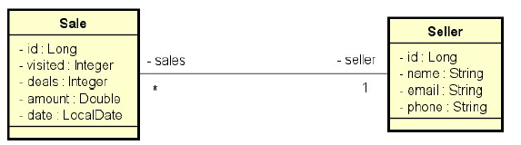

# Desafio: Consulta de Vendas

## Descrição

Este projeto consiste na implementação de consultas personalizadas para um sistema de vendas, permitindo a geração de dois tipos de informações:

- **Relatório de vendas:** apresenta as vendas realizadas, com informações sobre data, valor e vendedor.
- **Sumário de vendas por vendedor:** apresenta o total de vendas realizado por cada vendedor em determinado período.



## Especificações

### Relatório de vendas

O relatório deve permitir que o usuário consulte as vendas aplicando filtros opcionais.

#### Entrada

O usuário poderá informar:

- Data inicial;
- Data final;
- Um trecho do nome do vendedor.

Todos os parâmetros são opcionais.

#### Saída

O sistema deverá retornar uma **listagem paginada** contendo, para cada venda:

- ID da venda;
- Data da venda;
- Valor da venda;
- Nome do vendedor.

Apenas as vendas que atendam aos filtros informados deverão ser retornadas.

#### Regras

- Caso a **data final** não seja informada, deverá ser considerada a data atual do sistema:

```java
LocalDate today = LocalDate.ofInstant(
    Instant.now(),
    ZoneId.systemDefault()
);
```

- Caso a **data inicial** não seja informada, deverá ser considerada a data correspondente a **um ano antes da data final**:

```java
LocalDate result = minhaData.minusYears(1L);
```

- Caso o **nome do vendedor** não seja informado, deverá ser considerado um texto vazio (`""`).

> **Dica:** receba todos os parâmetros como `String` no Controller e realize o tratamento das datas no Service, convertendo-as para objetos `LocalDate`.

---

### Sumário de vendas por vendedor

O sumário deve apresentar o total de vendas realizado por cada vendedor em determinado período.

#### Entrada

O usuário poderá informar, opcionalmente:

- Data inicial;
- Data final.

#### Saída

O sistema deverá retornar uma listagem contendo:

- Nome do vendedor;
- Soma do valor das vendas realizadas pelo vendedor no período informado.

#### Regras

Devem ser aplicadas as mesmas regras de tratamento de datas definidas no **Relatório de vendas**.

## Exemplos de consultas

### Sumário de vendas

Consulta com período definido:

```http
GET /sales/summary?minDate=2022-01-01&maxDate=2022-06-30
```

Consulta sem parâmetros:

```http
GET /sales/summary
```

### Relatório de vendas

Consulta sem filtros:

```http
GET /sales/report
```

Consulta utilizando todos os filtros:

```http
GET /sales/report?minDate=2022-05-01&maxDate=2022-05-31&name=odinson
```

## Tecnologias

Este projeto utiliza tecnologias do ecossistema Java e Spring para implementação das APIs e consultas ao banco de dados.

## Referência

Desafio proposto pela [DevSuperior](https://devsuperior.club/).

---

**Todos os direitos reservados à DevSuperior.**